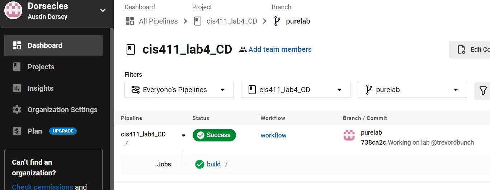
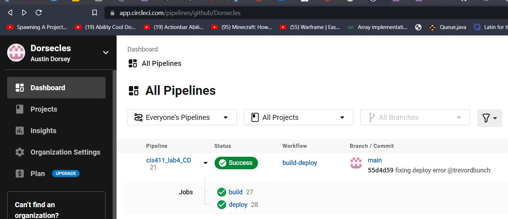

# Lab Report: UX/UI
___
**Course:** CIS 411, Spring 2021  
**Instructor(s):** [Trevor Bunch](https://github.com/trevordbunch)  
**Name:** Austin Dorsey  
**GitHub Handle:** Dorsecles  
**Repository:** https://github.com/Dorsecles/cis411_lab4_CD  
**Collaborators:** 
___

# Required Content

- [X] Generate a markdown file in the labreports directoy named LAB_[GITHUB HANDLE].md. Write your lab report there.
- [X] Create the directory ```./circleci``` and the file ```.circleci/config.yml``` in your project and push that change to your GitHub repository.
- [X] Create the file ```Dockerfile``` in the root of your project and include the contents of the file as described in the instructions. Push that change to your GitHub repository.
- [X] Embed _using markdown_ a screenshot of your successful build and deployment to Heroku of your project (with the circleci interface).  
> Example: 
- [X] Write the URL of your running Heroku app here (and leave the deployment up so that I can test it):  https://cis411lab4-dorsecles.herokuapp.com/graphql
> Example: [http://cis411lab2-trevordbunch.herokuapp.com/graphql](http://cis411lab2-trevordbunch.herokuapp.com/graphql)  
> 
- [X] Answer the **4** questions below.
- [X] Submit a Pull Request to cis411_lab4_CD and provide the URL of that Pull Request in Canvas as your URL submission.




## Questions
1. Why would a containerized version of an application be beneficial if you can run the application locally already?
> It makes it easier to run tests so the developer does not have to do it manually.
1. If we have the ability to publish directory to Heroku, why involve a CI solution like CircleCI? What benefit does it provide?
> It helps to make things go a little faster and easier.
3. Why would you use a container technology over a virtual machine(VM)?
> Containers are smaller and more efficient because they work fast.
4. What are some alternatives to Docker for containerized deployments?
> Hyper-V, Windows Containers, and Artifactory Docker Registry.